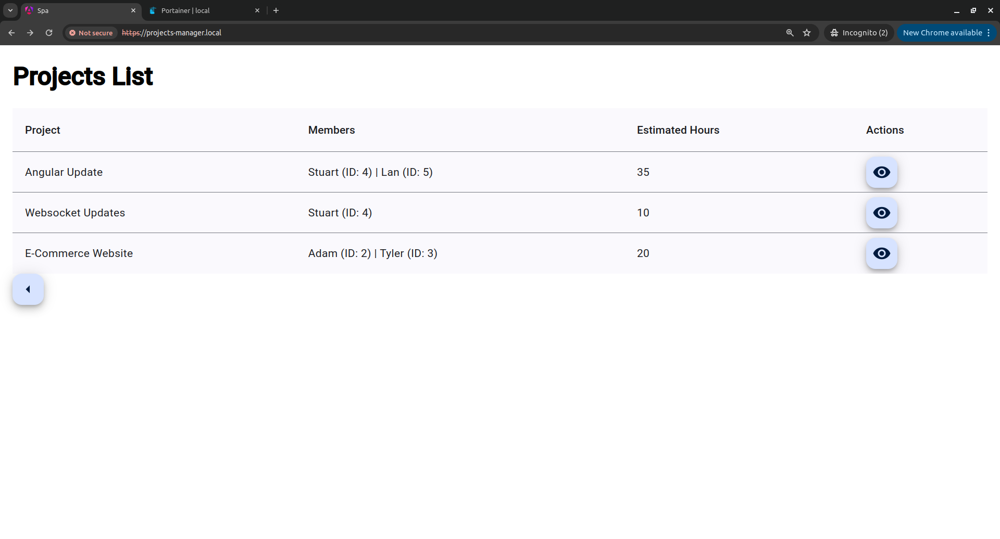
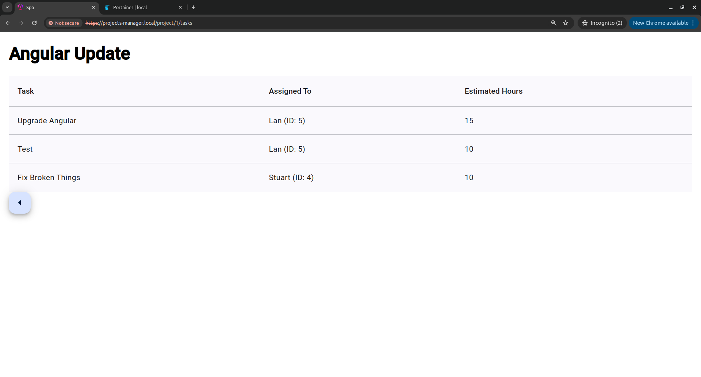
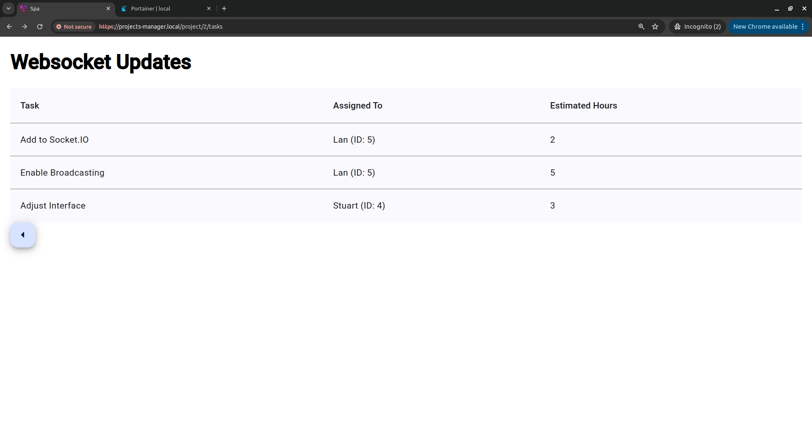
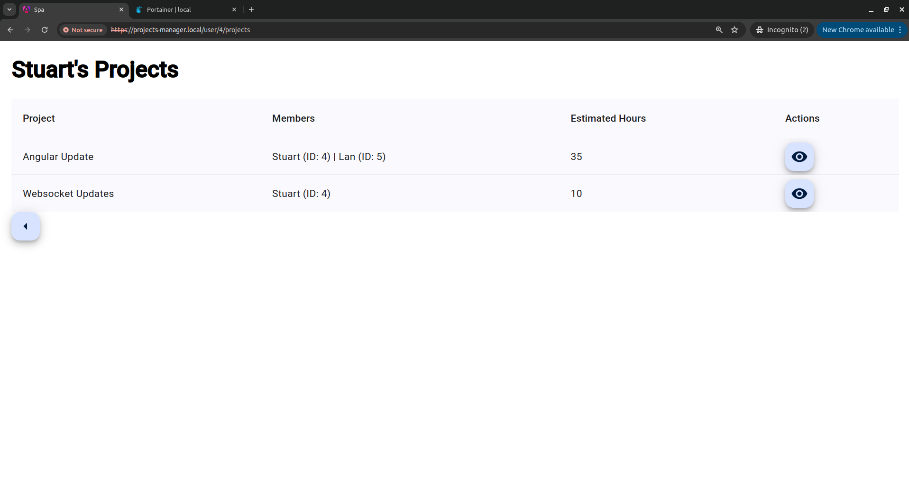
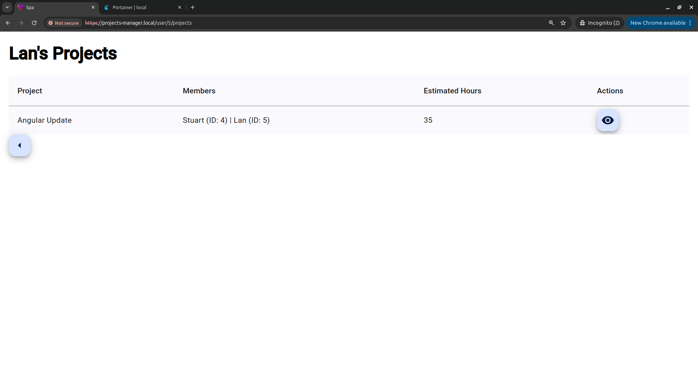
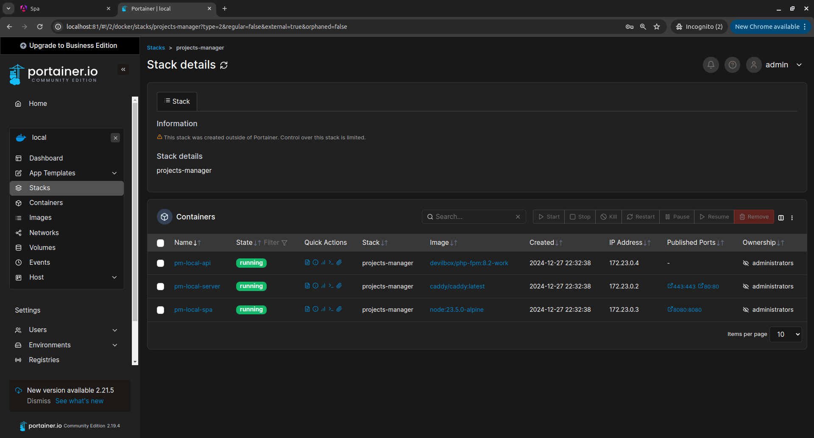

# Projects Manager

This is a simplified Laravel and Angular project to showcase database logic and data retrieval based on provided [requirements](./SampleProject.pdf).

---

## Setup Instructions

### Prerequisites:
- Docker installed on your system.
- Ensure `api.projects-manager.local` and `projects-manager.local` domains are configured in your `/etc/hosts`.

### URLs:
- **API (Laravel 11):** `http://api.projects-manager.local`
- **SPA (Angular 19):** `http://projects-manager.local`

### Steps to Run:
1. Clone this repository and navigate to the project directory:
   ```bash
   git clone <repository-url>
   cd projects-manager
   ```

2. Start the Docker containers:
   ```bash
   cd docker
   sudo docker-compose -f docker-compose.local.yml -p projects-manager up -d
   ```

3. For the frontend (Angular 19), ensure dependencies are installed:
   ```bash
   cd ../services/spa
   npm i
   npm start
   ```

---

## Troubleshooting

### If `composer install` fails with database seeding:
- In the `docker-compose.local.yml` file, update the `pm-local-api` service: Replace this line:
  ```bash
  command: sh -c "composer i; php artisan migrate --seed"
  ```
  with
  ```bash
  #    command: php-fpm
  ```
- Then manually run the following commands:
  ```bash
  docker exec -it pm-local-api sh
  composer i
  php artisan migrate --seed
  ```

---

## Screenshots

### Dashboard


### Project Details



### Assigned Projects



### Docker
